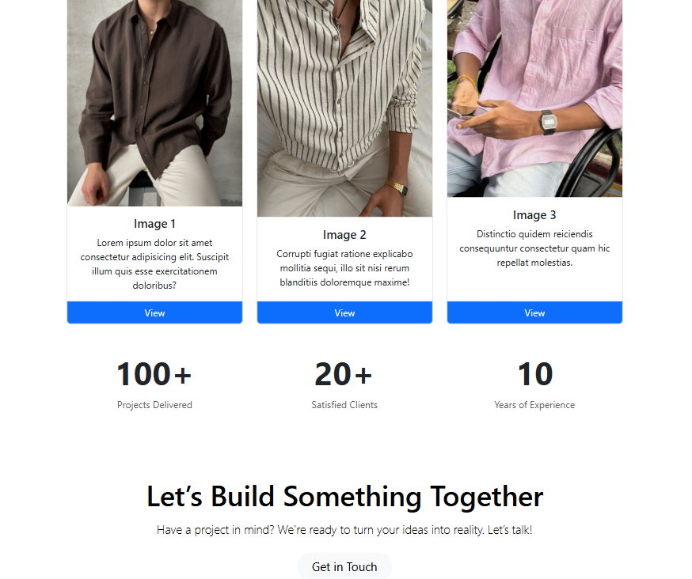
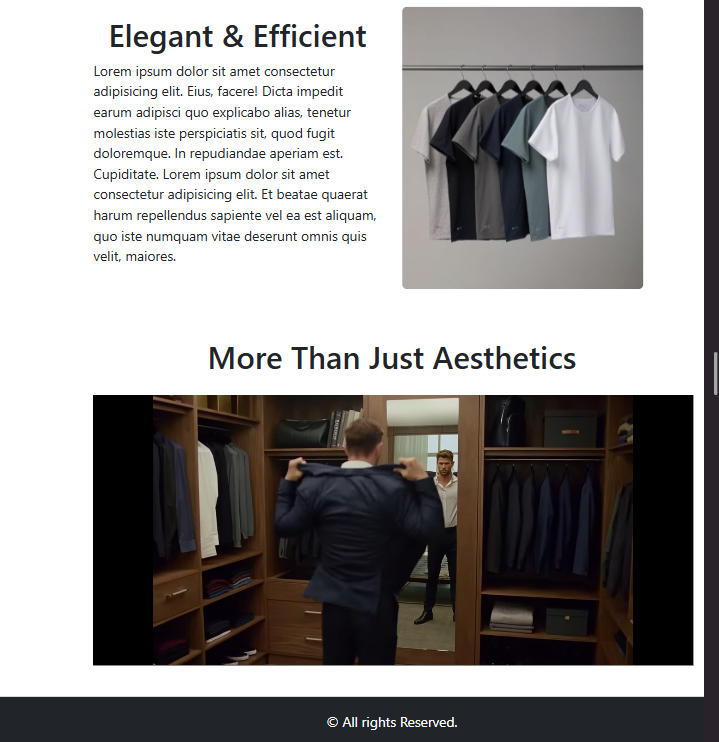
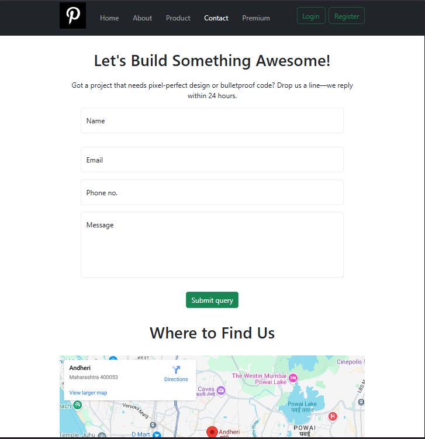
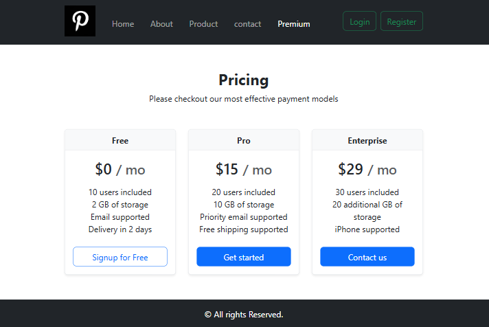
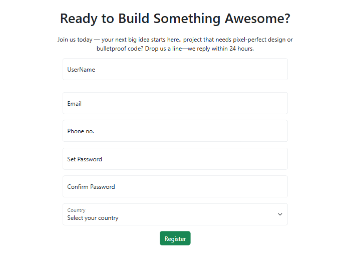

# 🌐 Responsive Website with HTML & Bootstrap

This is a responsive, multi-section website designed using **HTML5** and **Bootstrap 5**. It includes modern components like a navigation bar, image sections, cards, and a clean footer layout. The site is fully responsive and adapts well to different screen sizes.

### 📽️ Project Demo

[](https://youtu.be/7mSKAxhvd5A)


## 🖼️ Webpage Screenshots

Here are some visuals from the project:

### 🔹 Home Page




### 🔹 About List




### 🔹 Product Details


### 🔹 Contact Page


### 🔹 Premium Page


### 🔹 Login / Register Page



## 🚀 Features

- Responsive navigation bar
- Hero section with call-to-action
- Cards layout for showcasing content
- Image section with text overlay
- Footer with contact info/social links
- Mobile-friendly design using Bootstrap Grid

## 🛠️ Tech Stack

- **HTML5**
- **CSS3**
- **Bootstrap 5**

## 📁 Folder Structure

```bash
├── assets/
│   └── logo.png, img's.
├── screenshots/
│   └──  img1,img11.
├── home.html
├── about.html
├── Product.html
├── contact.html
├── Premium.html
├── Login.html
├── Register.html
└── README.md
```
## 🧪 Installation

To run this project locally:

```bash
git clone https://github.com/Aditya-deshmukh-1410/bootstrap_Ecom.git
cd bootstrap_Ecom
Open home.html in your browser
```


## 🙋‍♂️ Author

- **Aditya Deshmukh** (he/him)  
- GitHub: [@Aditya-deshmukh-1410](https://github.com/Aditya-deshmukh-1410)

🔗 GitHub Repo: [bootstrap_Ecom](https://github.com/Aditya-deshmukh-1410/bootstrap_Ecom)


## 🤝 Contributing
Contributions, issues, and feature requests are welcome!
Feel free to fork the repo and submit a pull request.


