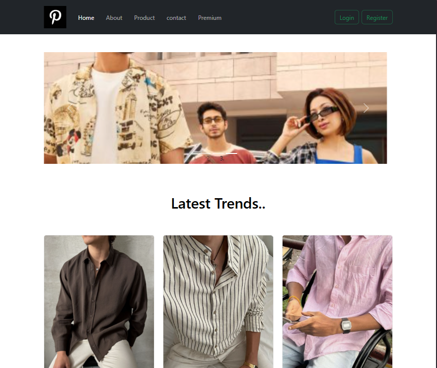
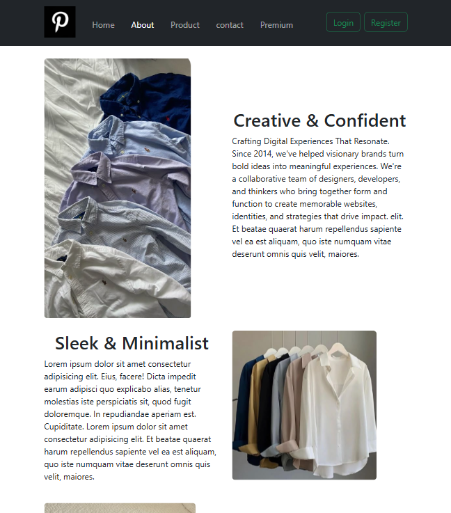
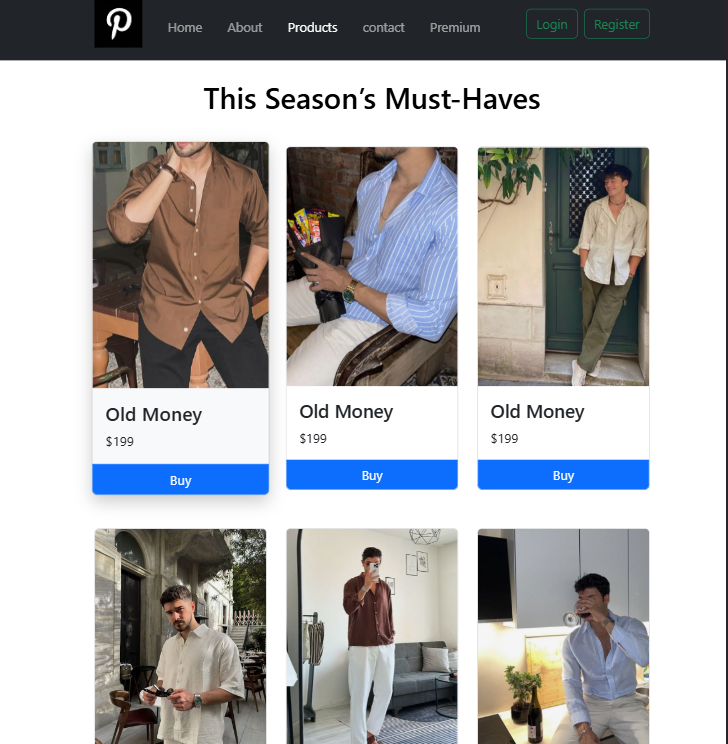

# 🌐 Responsive Website with HTML & Bootstrap

This is a responsive, multi-section website designed using **HTML5** and **Bootstrap 5**. It includes modern components like a navigation bar, image sections, cards, and a clean footer layout. The site is fully responsive and adapts well to different screen sizes.

### 📽️ Project Demo

[](https://youtu.be/7mSKAxhvd5A)


## 🖼️ Webpage Screenshots

Here are some visuals from the project:

### 🔹 Home Page



### 🔹 About List



### 🔹 Product Details


### 🔹 Contact Page


### 🔹 Premium Page


### 🔹 Login / Register Page


## 🚀 Features

- Responsive layout using Bootstrap Grid system.
- Hero section with call-to-action buttons and background image.
- Image sections with text overlays for visual appeal.
- Card-based layout to display products or content.
- Separate pages for Home, About, Products, Contact, Login/Register, and Premium.
- Contact form layout ready for backend integration.
- Clean footer with social media and quick links.

## 🛠️ Tech Stack

- **HTML5** – Structure and markup  
- **CSS3** – Custom styling and layout tweaks  
- **Bootstrap 5** – Responsive layout and prebuilt UI components


## 📁 Folder Structure

```bash
├── assets/
│   └── logo.png, img's.
├── screenshots/
│   └──  img1,img11.
├── home.html
├── about.html
├── product.html
├── contact.html
├── premium.html
├── login.html
├── register.html
└── README.md
```
## 🧪 Installation

To run this project locally:

```bash
git clone https://github.com/Aditya-deshmukh-1410/bootstrap_Ecom.git
cd bootstrap_Ecom
Open `home.html`  in your browser
```


## 🙋‍♂️ Author

- **Aditya Deshmukh** (he/him)  
- GitHub: [@Aditya-deshmukh-1410](https://github.com/Aditya-deshmukh-1410)

🔗 GitHub Repo: [bootstrap_Ecom](https://github.com/Aditya-deshmukh-1410/bootstrap_Ecom)

## 🔧 Future Enhancements
- Add backend support for login/register.
- Integrate product purchase with payment gateway.
- Implement animations using AOS or GSAP.


## 🤝 Contributing
Contributions, issues, and feature requests are welcome!
Feel free to fork the repo and submit a pull request.


